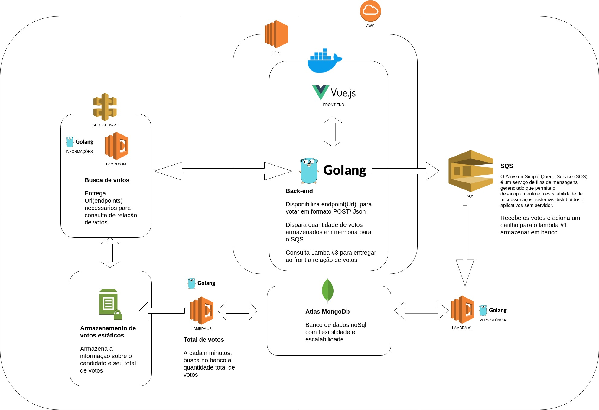

# Paredao BBB

This is a sample web application to simulate an eviction poll for the Big Brother reality show. It is based on the Brazilian version.

It is playground to play out with a scenario of huge network traffic, scalability, performance, etc (real world issues and requirements for the TV show, watched by millions of people).

## Considerations

The app itself simulates an eviction poll by 2 contestants to see who is going to leave the Big Borther house.

To handle the high number of requests per second when the search is running, the votes are not kept in real time because this would generate a high number of I/O operations. Instead, votes are stored in a cache and a background run routine runs every 10 seconds. This routine reads them and sends the computed votes to an Amazon messaging system. The system identifies a new message and activates a lambda function to store votes in a nosql mongoDb database managed by the MongoDb Atlas company.
Once this is done, every ten minutes, another lambda function is programmed to read the votes for candidate in the bank and store / update in a static information system from Amazon.
Finally, a third lambda function reads this information and delivers it to the front end without relying on a large number of I/O operations.
There are two other functions responsible for delivering information regarding the overall total votes and the total votes per candidate in each hour.

### Project diagram




### Setting

The environment was based on a Ubuntu 18.04. To set it up, execute:


#### Install Docker

Open a terminal window and type:
````
$ sudo apt-get update
````
It’s recommended to uninstall any old Docker software before proceeding
````
$ sudo apt-get remove docker docker-engine docker.io
$ sudo apt install docker.io

````
#### Install Docker-compose

Open a terminal window and type:
````
$ sudo curl -L https://github.com/docker/compose/releases/download/1.24.0/docker-compose-`uname -s`-`uname -m` -o /usr/local/bin/docker-compose
$ sudo chmod +x /usr/local/bin/docker-compose
````

### Running

````
$ git clone https://github.com/SelecaoGlobocom/globo-bbb-wall.git
$ cd globo-bbb-wall    
$ sudo docker-compose up
````


### Testing

Open [localhost:8080](http://localhost/8080).

To test wep-api:

### Urls lambda:

#### [Votes total](https://s5r119h3yd.execute-api.us-east-1.amazonaws.com/PROD/lambda_total_votes).

#### [Votes by participant](https://kiyyewrc3f.execute-api.us-east-1.amazonaws.com/prod/lambda_info).

#### [Votes by hour](https://9yrwu9s5r6.execute-api.us-east-1.amazonaws.com/prod/lambda_total_hours).


### Improvements and final thought

I would add more other containers to make a monitoring system using Prometheus and Graphana.
I would have done better to frontend task if he had more experience.
I would like to have developed an automation script to deploy in the cloud
I developed the project using some variables plated in the code. I would improve this to do everything by environment variables or searching the database.
I wish I had done more testing. It took me a while to finish the project and because of that I did not develop any tests

